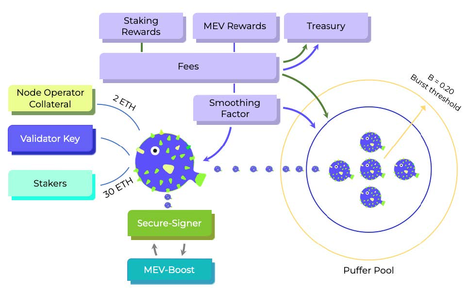

In the Puffer Pool, **Puffer Pods** are made up of one NoOp and multiple Stakers. The NoOp must
provide a 2 ETH bond and is then paired with Stakers, who contribute chunks of 30 ETH in increments
of 0.01 ETH. The Pod registers a validator key, generated by the NoOp’s Secure-Signer, and joins the
validator queue. Stakers mint Puffer's pufETH LSD (one-to-one with their staked ETH), while the NoOp mints
locked pufETH for their bonded ETH.
The NoOp operates Secure-Signer with MEV-Boost enforcement, splitting any execution rewards
based on the Smoothing Factor. Some ETH is immediately rewarded to the proposing NoOp, while
the rest is socialized across the Puffer Pool and Treasury. The consensus rewards are distributed to the
Pool with a small fee going to the Treasury to fuel protocol development. The ETH from consensus
rewards will automatically accrue on a weekly basis following the [Shanghai](https://notes.ethereum.org/@launchpad/withdrawals-faq) update.

