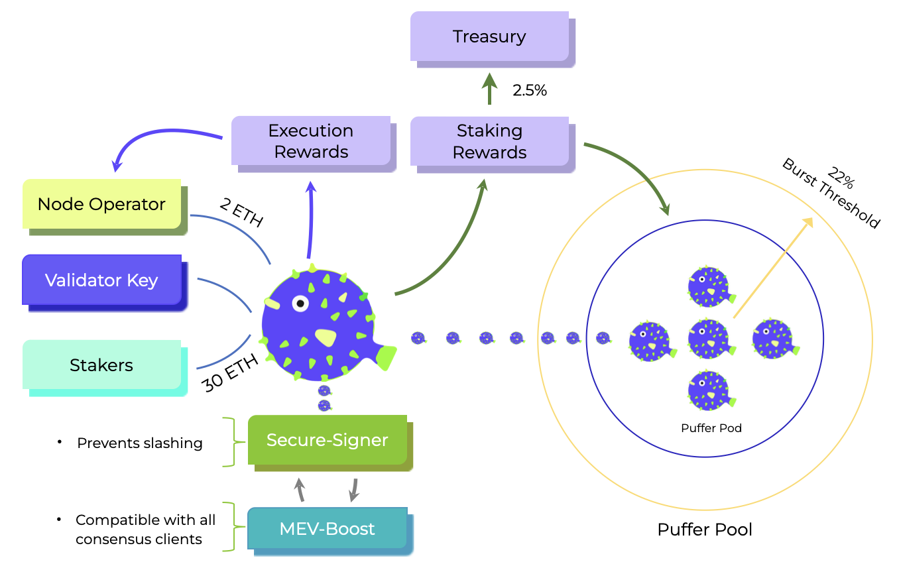

In the Puffer Pool, `Puffer Pods` consist of one NoOp and multiple Stakers. The NoOp must provide a 2 ETH bond and is then paired with Stakers, who contribute chunks of 30 ETH in increments of 0.01 ETH. The Pod registers a validator key, generated by the NoOp’s Secure-Signer, and joins the validator queue. Stakers mint Puffer's [pufETH LSD](arch/pufeth.md) (one-to-one with their staked ETH), while the NoOp mints
locked pufETH for their bonded ETH. The NoOp's pufETH serves as collateral while allowing them to earn consensus rewards on their 2 ETH bond beyond the execution rewards. 

As NoOps earn consensus rewards, following the [Shanghai/Capella](https://notes.ethereum.org/@launchpad/withdrawals-faq) upgrade, ETH will be partially withdrawn to the pool every week. The Treasury receives a 2.5% fee to fuel protocol development, while the remaining 97.5% is distributed to the pool, increasing the value accrued by pufETH.

||
|:--:|
|The Puffer Pool architecture.|

# Stakers
### Joining

To stake ETH on Puffer and receive pufETH (Pufffer's LSD), you simply need to connect your wallet and mint pufETH with as low as 0.01 ETH.

Your pufETH will accrue in value over time, and it will increase in value per the Pool's APR.

You can also stake pufETH on other DeFi platforms to earn more yield.

Example:
> - If you staked 1 ETH, you will receive 1 pufETH.
> - With an APR of 10%, your balance will increase, and your wallet will show 1.1 pufETH after some time.

### Exiting
Connect your wallet on [Puffer's website](https://www.puffer.fi/), burn pufETH, and reclaim your ETH + rewards.

--- 
# NoOps
To register as a Node Operator (NoOp) and spin up a validator instance at Puffer Pool you would follow these steps:

### Joining
> - Access Intel SGX-enabled hardware
> - Install Secure-Signer
> - Generate a fresh validator key and [RA evidence](tech/rave.md).
> - Deposit 2 ETH bond and RA evidence to onboarding contract.
> - Receive 2 pufETH (locked as collateral).
> - Get paired with 30 ETH from Stakers.
> - Wait for your validator instance to get registered at the consensus layer.
> - Begin attesting and proposing blocks to earn consensus and execution rewards.
> - Earn liquid ETH rewards each time you propose a block.

### Exiting
> - Submit a VoluntaryExit message.
> - Unlock your 2 pufETH. 
> - Use it in a DeFi protocol, hold it, or burn it for ETH + rewards.

---

# Burst Threshold
As part of Puffer's commitment to building a decentralized Ethereum, we are self-limiting the size of the Puffer Pool. We refer to this as the `Burst Threshold` with a maximum capacity of 22%. This means that if the Puffer Pool reaches 22% of the validator set, pufETH minting and NoOp onboarding will freeze. 

This commitment is critical to ensure that the Puffer Pool never breaches the dangerous consensus threshold of 33%, which threatens the stability of Ethereum. We firmly believe that the Burst Threshold must be included from day one rather than after the pool is profitable.
