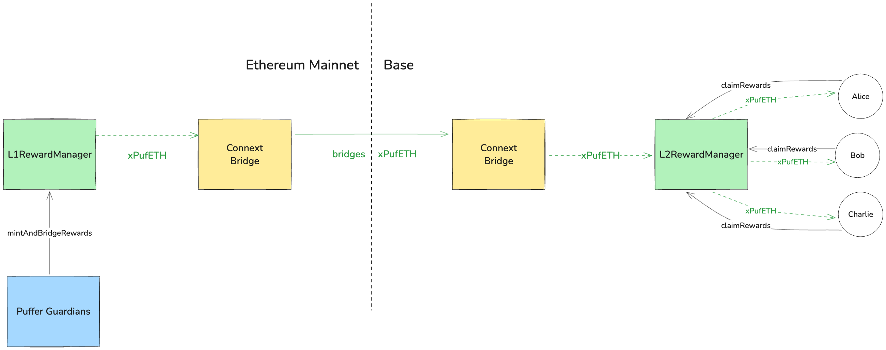

# Rewards Overview

Following the implementation of Puffer's 'Fast Path Rewards' upgrade, Node Operators will have the ability to claim their consensus layer rewards efficiently and with minimal gas costs on the [Base Layer 2 blockchain](https://www.base.org/).

Since Puffer validators are natively restaked on EigenLayer, their consensus layer rewards flow to EigenPod contracts owned by PufferModule contracts. In the Fast Path Rewards (FPR) upgrade, the Puffer Guardians will calculate the consensus layer reward ETH that has reached the EigenPods, then mint corresponding rewards as pufETH and bridge it to Base Layer 2 using the [Everclear (Connext) bridge](https://bridge.connext.network/) and the XERC20 standard. Once on Base, Node Operators can claim xPufETH rewards, which is equivalent to the pufETH token on Ethereum Mainnet but exists on the Base network.

# The Process

Rewards are distributed daily, with the exception of the first distribution, which includes all rewards accumulated since Puffer's mainnet launch.

For each daily interval, Puffer's Guardians perform the following steps:
1. Compute individual rewards for each Node Operator (sum of all of their associated validators)
2. Calculate the total rewards for the previous intervals
3. Create and publish a Merkle tree of rewards, storing it on AWS S3
4. Mint pufETH tokens and transfer them to the Base Layer 2 network
5. Enforce a mandatory waiting period to revert in case of a security vulnerability
6. Once the waiting period ends, Node Operators can claim their rewards through the L2RewardManager contract on Base using the Puffer Dashboard

## Setting the Rewards Recipient on Base

:::caution
Node Operators who used a smart contract (such as a multisig wallet) to register their validators on Ethereum Mainnet **MUST** set a specific rewards claimer address on Base. This step is crucial; without it, they may be unable to claim their rewards on Base.

The reason for this requirement is that addresses on Ethereum Mainnet do not automatically correspond to the same addresses on Base. Therefore, to ensure you can access your rewards, you need to explicitly specify which address on Base should be authorized to claim them.
:::

To set the rewards claimer on Base, a Node Operator should follow these steps:

1. Navigate to the [Puffer Dashboard](https://puffer.fi/dashboard)
2. Initiate a `Set Rewards Claimer` transaction. This transaction occurs on Ethereum Mainnet but will be relayed to Base.
3. Wait for the transaction to be bridged from Ethereum Mainnet to Base Layer 2. This process typically takes between 3 to 6 hours, but may take longer if the relayer fee is insufficient.
4. After the transaction is confirmed on Base, the Node Operator can now claim rewards using the specified rewards claimer address on Base.

:::note
Externally Owned Accounts (EOAs) do not need to perform this step. For EOAs, rewards will automatically be sent to the same address that registered the validators on Ethereum Mainnet.
:::