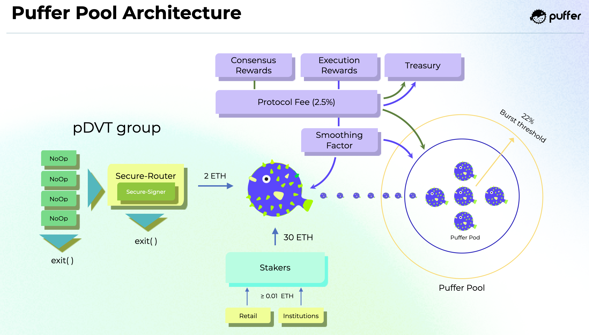

<!-- > ### :blowfish: Puffer is the first liquid staking protocol built on Eigenlayer :blowfish: -->

> Puffer's goal is to make validating more accessible and profitable for at-home nodes, thereby contributing to Ethereum's security and censorship resistance. :blowfish:

Restaking is a paradigm shift that will forever change web3's infrastructure and unlock unprecedented value for Ethereum validators and the [AVSs](#puffer-protocol-rules) they operate. However, as with earlier developments like MEV and liquid staking, there is potential to centralize Ethereum. Now that Pandora's Box is opened, building protocols that preserve decentralization is essential. In pursuit of this goal, Puffer has built the first native liquid staking protocol on [Eigenlayer](https://www.eigenlayer.xyz/) with Ethereum's ethos in mind. To counteract the risk of centralization, Puffer is preemptively [self-capping its pool size](#burst-threshold) and implementing guardrails to mitigate the negative externalities that restaking may have on the Ethereum ecosystem.

At its core, the Puffer Protocol is a liquid staking protocol where node operators are permissionlessly allocated ETH to launch an Ethereum PoS validator. Puffer nodes can restake to operate AVSs on top of Eigenlayer. Puffers are users who stake ETH for the pufETH LST, which is expected to increase in value over time as the Puffer Protocol accrues validator and restaking rewards. PUFI token is used to govern the protocol via voting in the Puffer DAO. Some important duties include approving which AVSs Puffer nodes can use and which ones to allocate protocol treasury ETH to in the form of Economic Security as a Service (ESaaS). 

### Guiding Principles
The Puffer Protocol functions as a platform to increase the profitability of at-home nodes operating as Ethereum validators and web3 infrastructure providers, helping to cement a pocket of decentralization within the wider validator set. This is achieved through three core guiding principles:

1. *increase capital efficiency*:
> By reducing the amount of ETH required to operate a node, Puffer allows for far greater node participation and diversity than the status quo. However, [care must be taken](../background/slash.md#liquid-staking-protocol-considerations) to protect both nodes and stakers. Puffer's [Secure-Signer](../tech/securesigner.md) and [Guardians](#guardians) allow the bond requirement to be reduced to just 2 ETH by mitigating the risk of slashing and inactivity penalties. In the future, Puffer's [Fractal DVT](#dvt-in-puffer) massively decreases the barrier as hundreds of nodes can split the bond requirement. 

2. *increase economic opportunities*:
> To truly incentivize people to run nodes from home, increasing node operator profit margins is essential. Decentralized liquid staking protocols that fail to do so will need help attracting nodes, as they are economically better off staking their ETH on centralized platforms at the expense of Ethereum's security. In the Puffer Protocol, nodes can increase their profit margins by restaking to operate unique web3 infrastructure and services. 

3. *increase hardware efficiency*:
> Validators must pay an upfront hardware cost and ongoing electricity and internet costs that hurt their overall profitability. Additionally, validator hardware must be better utilized as the main duty of signing attestation messages is only required once per epoch (every 6.4 minutes). Restaking increases the hardware efficiency as the latent compute power can generate additional revenue streams to get a better ROI on their hardware. TEE-compatible hardware comes at comparable costs to the hardware typically recommended for Ethereum validators. Puffer nodes using TEEs benefit from slash protection to reduce risk and unlock unique restaking services, maximizing their ROI on the fixed hardware costs.

<!--  -->

### Puffer Protocol Rules
Since the Puffer Protocol is built on top of Eigenlayer, its rules can be defined as an [actively validated service](https://github.com/Layr-Labs/eigenlayer-contracts/blob/master/docs/AVS-Guide.md) or AVS. Eigenlayer defines AVSs as services or middlewares that a restaker can opt in to, where provably incorrect behavior can be programmably slashed. For example, a validator's 32 ETH deposit can be programmably slashed if fraud is proven while restaking to operate an optimistic rollup. If the Puffer Protocol's AVS is violated, the offending validator's ETH will be programmably slashed, and the amount distributed back to the pool.

1. To actively protect Puffers' ETH from [inactivity penalties](../background/slash.md#inactivity-risk), each validator's [current balance](https://kb.beaconcha.in/glossary#current-balance-and-effective-balance) is required to remain above a threshold set by the Puffer DAO. This threshold should be low enough to allow reasonable downtime but high enough to incentivize good performance. 
2. MEV-Smoothing is vital to curb centralization within the protocol. It allows at-home nodes to earn more than they would on their own and reduces the economies of scale of centralized staking operations. Validators proposing blocks are required to distribute the execution rewards with the pool. If theft is proven on-chain, the offending validator is penalized. 

### Puffers
Puffers are the individuals who stake their ETH at the Puffer Protocol to receive the pufETH liquid staking token. When the Puffer stakes `≥ 0.01` ETH it is added to a pool of ETH. Part of this pool is provisioned to nodes to meet the 32 ETH requirement to activate an Ethereum validator, and the rest provides exit liquidity for when Puffers want to redeem ETH for their pufETH. 

### Nodes
The ETH staked by Puffers buoy the Puffer Protocol, so protecting them is one of the protocol's main priorities. The protocol requires all nodes to be economically bonded for proper incentivization, and should penalties accrue, they are first deducted from this bond. To minimize penalties, enclaves reduce slashing risk, while Guardian support is in place to counteract node inactivity.

To accommodate different risk preferences and ETH requirements, nodes can choose from three modes of operation, ranging from high to low capital efficiency, with corresponding requirements. Secure-Signer nodes enjoy increased capital efficiency and access to [enclave](../tech/securesigner.md#what-is-it)-specific AVSs. Guardian support is currently needed for bonds less than 16 ETH to prevent inactivity penalties from threatening staker eth until [EIP-7002](https://github.com/ethereum/EIPs/pull/7002) removes this requirement. Before this, nodes with a 16 ETH bond could join without Guardian support.

Capital Efficiency | Bond (ETH) | Guardian Support | TEE Required
--- | --- | --- | ---
High | 2 ETH | Yes | Yes
Mid | 4 ETH | Yes | No
Low | 16 ETH | No | No

### Rewards
pufETH is a reward-bearing token akin to [Compound's cToken](https://docs.compound.finance/v2/ctokens/#ctokens), which is optimal regarding DeFi compatibility. As the protocol generates rewards, the amount of ETH backing pufETH increases, increasing the conversion rate between the two. Holding liquid pufETH allows one to earn staking and restaking rewards over time while still being able to participate in DeFi.

**Puffer Rewards** 
> Puffers deposit ETH at the PufferPool contract to mint pufETH. At the protocol's inception, the conversion rate would be one-to-one, but assuming the protocol performs well, i.e., accrues more rewards than penalties, the conversion rate would value pufETH higher than ETH. Thus Puffers holding pufETH can expect its value to increase over time.

**Node Rewards**
> Upon registering validator keys, Puffer nodes mint their bond's worth of pufETH, which is locked until they exit the protocol. As the node generates consensus, execution, and restaking rewards, they are rewarded liquid ETH dependent on commission rates set by the Puffer DAO, with the remainder sent to the PufferPool and treasury. Since nodes hold locked pufETH, they also share in the rewards generated by other nodes in the protocol. This allows for efficient MEV-Smoothing and helps to align node incentives. 

### Guardians
The Guardians are a permissioned set of nodes whose job is to ensure the smooth functioning of the protocol. They have two responsibilities that will eventually be phased out as [EIP-4788](https://eips.ethereum.org/EIPS/eip-4788) and [EIP-7002](https://github.com/ethereum/EIPs/pull/7002) are implemented in upcoming hardforks:
1. *reporting the amount of ETH that backs pufETH*
> To calculate the conversion ratio between ETH and pufETH, the main contract must be aware of the amount of ETH currently backing the protocol. This requires summing the on-chain balances of all active validators with their current balances on the beacon chain. The Guardians are currently responsible for performing this computation, but after EIP-4788, this will be replaced by a trustless ZKP.

2. *exiting nodes who breached the Puffer Protocol AVS*
> The first rule in the [Puffer Protocol AVS](#puffer-protocol-rules) is in place to protect offline nodes from harming Puffers. Unfortunately, until EIP-7002 is implemented, exiting validators cannot be done on-chain but instead requires signing exit messages with the validator's key. Since EIP-7002 may take years to implement, to be practical and proactive about preserving decentralization before it is too late, the Puffer Protocol requires its nodes with a `< 16` ETH bond to encrypt their validator keyshares to the Guardians' enclaves. These enclaves are implemented such that they can only sign an exit message with the validator keyshare. As soon as EIP-7002 is implemented, the Guardian 'training wheels' will be removed. 

To reduce counterparty risk, the Guardians have many guardrails in place. They are composed of public community members with a strong alignment with Ethereum's ethos and reputation at stake. The Guardians must use enclaves to increase the security of their actions and require quorum from a high threshold of Guardians (e.g., 8/9 signatures). 

### Withdrawals
**Puffer Withdrawals**
> Puffers can burn their pufETH to redeem their original ETH plus the accrued rewards when there is sufficient liquidity in the protocol's withdrawal pool. A portion of all Puffer deposits, rewards, and node withdrawals are added to the withdrawal pool to provide exit liquidity. 

**Node Withdrawals**
> Nodes can fully withdraw from the Puffer Protocol by proving they have exited from the beacon chain. Upon fully exiting the Puffer Protocol, their locked pufETH is burned and redeemed for liquid ETH equal to their `original bond + accrued rewards - penalties`. For example, if a node with a 2 ETH bond exits with a validator balance of 32 ETH and the ratio of pufETH:ETH has doubled since they registered, they would receive 4 ETH, and 28 ETH is returned to the pool.

### Governance
One of Puffer's goals is to build an unstoppable decentralized protocol that can eventually continue to grow and operate without relying on Puffer's core team. For this reason, we strive to minimize the role of governance in the protocol. 
The PUFI token will primarily be used for the following: 
- pausing and upgrading contracts in the event of vulnerabilities and Ethereum hard forks
- voting on protocol parameters like commission rates
- managing the Puffer Protocol treasury in the form of grants and ESaaS
- whitelisting AVSs that are aligned with Ethereum's ethos

### Restaking
Since Puffer is built on Eigenlayer, all Puffer nodes can become native restakers to increase their rewards. Such restaking jobs span from important middlewares such as bridges and oracles to services like data availability layers and L2 sequencers. Additionally, the nodes with enclave support can participate in AVSs unique to Puffer, like privacy-preserving L2s and [ZK-2FA](https://ethresear.ch/t/2fa-zk-rollups-using-sgx/14462). Puffer is committed to supporting only the AVSs that are not considered [problematic for Ethereum](https://vitalik.ca/general/2023/05/21/dont_overload.html).

### DVT in Puffer
The Puffer Protocol has been designed to be compatible with DVT. When used with Secure-Signer, this combination provides the best slash-protection guarantees. Stay tuned for more information on Puffer's Fractal DVT, an extension of DVT that is only possible through enclaves. Fractal DVT allows DVT clusters to scale far beyond what is possible using standard DVT, allowing for greater decentralization and bond reductions.

### Burst Threshold
As part of Puffer's commitment to Ethereum's decentralization, the size of the Puffer Pool will be self-capped. This is called the *Burst Threshold* with a maximum capacity of 22%. If the Puffer Pool reaches 22% of the validator set, pufETH minting and node onboarding will freeze. 

This commitment is critical to ensure that the Puffer Pool never breaches the [dangerous consensus threshold of 33%](https://twitter.com/dannyryan/status/1688644951230267392?s=46&t=bsdBaPIHlTHEWDDdVUJW4g), which threatens the stability of Ethereum. We firmly believe that the Burst Threshold must be included from day one rather than after the protocol is profitable.