## Background & Context

Understanding why Puffer Preconf exists helps explain how the protocol solves critical challenges facing Layer 2 rollups today.

### The Ethereum Scalability Challenge

Ethereum faced significant scalability issues due to limited transaction throughput and high gas fees, leading to the development of a rollup-centric roadmap focused on scaling Ethereum using Layer 2s.

#### The Role of Rollups

Rollups aim to increase Ethereum's transaction capacity by processing transactions off-chain and submitting batched results to the Ethereum mainnet. However, traditional rollups face several challenges:

- **Slow Finality**: It takes at least 12 seconds for Ethereum block confirmations and 12 minutes for finality
- **Security Trade-offs**: Some solutions compromise on security for speed
- **Fragmented Liquidity**: Different rollups have isolated liquidity pools and users
- **Centralization**: Centralized sequencers can be points of failure for rollups

#### Based Rollups: A Step Forward

[Based rollups](https://ethresear.ch/t/based-rollups-superpowers-from-l1-sequencing/15016) offer a promising solution to many of these challenges by having transactions sequenced by Ethereum validators themselves.

**Key Features of Based Rollups**:

- **Validator Sequencing**: Rather than a centralized sequencer, L1 validators order transactions
- **Inherited Security**: Rollups inherit Ethereum's security directly with no additional trust assumptions
- **Synchronous Composability**: Different based rollups can interact atomically
- **Aligned Economics**: MEV flows back to Ethereum validators

**The Speed Challenge**: Despite their advantages, based rollups are limited by Ethereum's block time (12 seconds), leading to slower transaction confirmations than desired for many applications.

### Preconfirmations: The Latency Solution

To address the speed limitations of based rollups while maintaining decentralization, the concept of [preconfirmations](https://ethresear.ch/t/based-preconfirmations/17353) was introduced.

#### What are Preconfirmations?

Preconfirmations provide near-instant transaction assurances by leveraging a network of Ethereum validators:

- **~100ms Confirmations**: Drastically reduce wait times by having validators quickly process and sign off on incoming transactions
- **Economic Security**: Validators stake ETH as collateral, ensuring honest behavior with slashing penalties for breaking promises
- **Decentralization**: Multiple validators participate, preventing single points of failure
- **Gap Bridging**: Users receive rapid feedback on transaction validity, allowing rollups to process transactions with confidence before L1 finality

#### Requirements for a Preconfirmation Protocol

To build an effective preconfirmation protocol for based rollups:

1. **Validator Network**: A network of Ethereum validators willing to participate, with open participation
2. **Economic Incentives**: Rewards for honest participation and penalties for malicious behavior
3. **Security Guarantees**: Cryptographic proofs of validator commitments
4. **Standardization**: On-chain registry of validators and common interfaces (e.g., Commit-Boost)
5. **Capital Efficiency**: Integration with restaking protocols like EigenLayer

### Puffer Preconf: Solving the Challenges

Puffer Preconf is one of the first production implementations of a preconfirmation protocol for based rollups, addressing both speed and economic challenges.

**Why EigenLayer?**

Preconfers and gateways require economic security to guarantee honest operations. Restaking protocols like EigenLayer provide:

- **Capital Efficiency**: Validators reuse existing restaked ETH
- **Economic Security**: 3M ETH in restaked assets backing Puffer Preconf
- **Proven Infrastructure**: Battle-tested AVS framework
- **Slashing Capabilities**: Support for slashing and redistribution
- **Large Validator Set**: Many validators already opted into restaking

**Neutrality & Permissionlessness**:

For Puffer Preconf to serve the entire Ethereum ecosystem:

- **No Token Gating**: No governance tokens required to participate
- **Equal Treatment**: All L2s receive the same service level
- **Aligned Economics**: Validators earn from all L2s, not just UniFi
- **Multiple Gateways**: Independent operators (Gattaca, Google, etc.)
- **Open Source**: Transparent, auditable codebase

## Overview

Puffer Preconf is composed of off-chain software for handling preconf operations, and on-chain AVS contracts for handling registrations, rewards, and slashing.

### Definitions

The Puffer Preconf ecosystem involves several key components and actors:

- **Users**: Individuals or applications (typically on L2s) that submit transactions to be preconfed.
- **Operators**: Entity controlling Ethereum validators as part of the Puffer Preconf protocol on EigenLayer.
- **UniFiAVSManager**: On-chain contract responsible for managing operator and validator registrations, as well as maintaining the overall state of Puffer Preconf AVS.
- **Gateway**: Specialized off-chain entity that acts as an intermediary between L2 users and validators to fulfill preconfirmation requests.
- **Commit-Boost**: Open-source software that standardizes the interface between validators and different types of commitment modules.
- **RewardsManager**: On-chain contract that handles the distribution of rewards to operators, validators and gateways based on their participation and performance.

## Protocol Architecture

### High Level Preconf Flow

```mermaid
sequenceDiagram
    autonumber
    participant U as 👤 L2 Users
    participant O as 👨‍💼 Operator
    participant UAM as 📋 UniFiAVSManager
    participant G as 🌐 Gateway
    participant BN as 📡 Beacon Node
    participant CB as ⚡ Commit-Boost
    participant RM as 💰 RewardsManager
    participant L1 as 🔗 Ethereum L1

    Note over O,UAM: 🚀 Registration Phase
    O->>UAM: Set delegate key to Gateway

    Note over G,BN: 🔍 Discovery Phase
    G->>BN: Query lookahead window
    BN-->>G: Return upcoming proposer indices

    loop 🔄 For each validator
        G->>UAM: getValidator(validatorIndex)
        UAM-->>G: Validator registration status
    end

    Note over G: ✅ Confirm Gateway is delegated to

    Note over U,G: 💳 Transaction Phase
    U->>G: Send L2 transactions to preconf RPC
    G-->>U: Return Gateway-signed execution preconfs

    Note over CB: ⏳ wait for slot...

    Note over CB,L1: 🏗️ Block Production Phase
    CB->>G: Request L1 block
    G-->>CB: Provide L1 block with L2 batch
    CB->>L1: Propose L1 block

    Note over L1,G: 💸 Fee Distribution
    L1->>G: gateway fee

    Note over O,RM: 🎁 Rewards Phase
    O->>RM: Claim AVS rewards
```

The preconf flow in Puffer Preconf involves several interactions:

1. Operators set their delegate key to point to a Gateway
2. Gateway queries the Beacon Node for the lookahead window to check upcoming proposers
3. Gateway checks if any of the upcoming proposers are delegated to them
4. L2 users send transactions to the Gateway's preconf RPC endpoint
5. Gateway returns signed execution preconfs to L2 users
6. Commit-Boost requests L1 block from Gateway when it's time to propose
7. Validator proposes L1 block to Ethereum network (including L2 batch settlement)
8. Rewards are distributed through the RewardsManager to validators, gateways, and L2 operators

## What is Being Preconfed?

Puffer Preconf is designed to be a flexible and generic protocol capable of supporting various types of proposer commitments in the future. Initially, the focus is on **L2 execution preconfirmations**, which provide powerful guarantees for based rollup users.

### Execution Preconf vs. Inclusion Preconf

There is a critical distinction between execution and inclusion preconfirmations:

**Inclusion Preconf** (Weaker Guarantee):
- Guarantees transaction will be included in a block
- Does NOT guarantee the execution state
- Blockchain state may change between confirmation and execution
- Final execution result may differ from expected

**Execution Preconf** (Stronger Guarantee):
- Guarantees transaction will be included AND executed with specific state
- Commits to exact execution results
- State is "locked in" at time of preconf
- Final execution matches preconf exactly

:::tip
As Puffer Preconf evolves, it may support additional types of preconfirmations (L1 inclusion preconfs, cross-L2 atomic transactions, etc.), further expanding its utility in the Ethereum ecosystem.
:::

## Gateway Architecture

*Gateway architecture enabling fast L2 execution preconfs. Full description: [Becoming Based: A Path Towards Decentralised Sequencing](https://ethresear.ch/t/becoming-based-a-path-towards-decentralised-sequencing/21733)*

L1 proposers establish a schedule of gateways called **lookahead**, which maps L1 slots in a given epoch to gateways. Each gateway holds the write access on the L2 state for a number of L1 slots, and must post these blocks as batches on the L1 via the rollup inbox contract.

Because the gateway holds a temporary exclusive right to modify the L2 state, it can provide fast execution preconfs to users, *before* the batch is fully settled on the L1.

### Lookahead Mechanism

The lookahead provides predictability and structure to the preconf service:

<!-- PLACEHOLDER: Lookahead Schedule Visualization
Description: Timeline visualization showing L1 slots (1-32+) mapped to different gateways in rotation, with visual indicators for batch settlement deadlines and handoff periods between gateways -->

**Key Properties**:
- **Deterministic Scheduling**: L2s and users know in advance which gateway will service upcoming slots
- **Exclusive Write Access**: Each gateway has sole sequencing rights during its slot window
- **Smooth Transitions**: Next gateway receives L2 state before its slot begins
- **Accountability**: On-chain record of which gateway was responsible for each slot

**Benefits for L2s**:
- Predictable service availability
- Time to sync state before issuing preconfs
- Clear accountability for each time period

### Block Production and Sync

Subsequent gateways in the lookahead schedule (e.g. Gateway B in the diagram) must obtain the latest L2 state to issue preconfs after the slot transition. Other applications, such as explorers, wallets, and indexers, may also need access to the latest L2 state before it is settled on the L1.

Relying solely on the L1 state (i.e. waiting for the L2 to sync after the batch has been posted) would result in "gaps" during which no preconf can be issued. This is because:

- **Gateway A** needs to stop issuing preconfs X seconds before the start of the next L1 slot to ensure that the L2 batch gets settled on the L1
- **Gateway B** will only receive this updated state Y seconds after the start of the next L1 slot

To eliminate these gaps, gateways sync L2 state directly with each other before batches are posted to L1.

**State Sync Flow**:
1. Gateway A builds L2 blocks and issues preconfs during slots 1-10
2. Near end of slot 10, Gateway A sends latest L2 state to Gateway B
3. Gateway B verifies state and prepares to sequence from that state
4. Gateway A posts batch to L1 before slot 11
5. Gateway B begins issuing preconfs at slot 11 with no gap

More detailed gateway architecture: [Gateway Block Building & Pipelining](https://gattaca-com.github.io/based-op/architecture/gateway#block-building--pipelining)

### Featured Gateway: Gattaca

**[Gattaca](https://gattaca-com.github.io/based-op/)** provides production-ready preconf services for OP-based rollups:

**Key Features**:
- **Frags Architecture**: Sub-block units enabling sub-100ms confirmations
- **Production Tested**: Live and serving preconf traffic
- **OP Stack Integration**: Native support for OP-based rollups
- **High Availability**: Enterprise-grade reliability

**Coming Soon: Google Gateway**
Google will join as a gateway provider, offering:
- Enterprise infrastructure and global redundancy
- Additional decentralization through multiple gateway operators
- Enhanced geographic distribution

## Slashing

Gateways provide collateral to enter the lookahead. The collateral is subject to slashing conditions when preconf promises are violated, and also incentivizes timely settlement of batches on the L1.

### Slashing Conditions

#### Gateway Failure Scenario

**Scenario: Gateway Fails to Settle**

If Gateway A fails to settle the required batch on the L1 by end of its slots, the next gateway in the lookahead schedule (Gateway B) will have to re-create and settle the L2 batch transaction(s).

By doing so, Gateway B:
- Can claim part of the collateral of the previous gateway (i.e., the faulty gateway is slashed)
- The slash amount is proportional to the number of preconf blocks which haven't landed
- Avoids an L2 reorg and ensures that the L2 advances to where it started issuing preconfs

**Implementation**:
In practice, when processing the L2 batch transaction, the inbox contract verifies if the signed blocks are signed by the previous gateway. If so, it will slash Gateway A's collateral and transfer it to Gateway B posting the batch instead.

**Collateral Requirements**:
If, following a slashing event, the collateral amount falls below a specified threshold, the gateway becomes ineligible for future lookaheads until the collateral is replenished.

**Challenge Period**:
Taking advantage of the EigenLayer slashing infrastructure, we can create a challenge period where the slashed gateway can submit a fault proof to dispute unjust slashing.

### Slashing to Redistribution vs. Burning

The logic behind slashing in Ethereum PoS is that when a validator is penalized, all ETH holders are compensated via a reduction in the total ETH supply (burning).

**Puffer Preconf's Approach**:
In Preconf slashing, the slashed ETH benefits participants who request or use the Preconf service. This redistribution mechanism—now offered by EigenLayer—fosters better economic alignment.

**Benefits**:
- Direct compensation for affected users and L2s
- Stronger incentive alignment (protect the actual harmed parties)
- More transparent accountability

**Recipients of Slashed Funds**:
- Users whose preconfs were violated
- L2 operators affected by settlement failures
- Next gateway that had to cover for failed gateway

:::caution Current Status
The full slashing implementation will be deployed in Phase 3 and depends on EigenLayer's slashing design, which is still being finalized. See the [Roadmap](/puffer-preconf/puffer-preconf-roadmap) for details on phased rollout.

In Phase 1, gateways forfeit rewards for missed proposals but are not slashed.
:::

## On-Chain Components

Puffer Preconf utilizes several smart contracts to manage its operations:

1. **UniFiAVSManager**: Handles AVS registrations, including operator and validator registrations.
2. **RewardsManager**: Manages the distribution of rewards to operators, validators, gateways, and L2 operators.
3. **DisputeManager**: Implements the slashing mechanism to penalize misbehaving validators (future phase).

### Registration

Puffer Preconf implements a double opt-in registration process for operators and validators, ensuring security and flexibility:

1. **Operator Onboarding**:

   - Operators first register with EigenLayer's delegation system.
   - They then opt into the Puffer Preconf AVS, signaling their intent to participate.
   - The Puffer Preconf AVS system records the operator's registration in EigenLayer's AVS directory.

2. **Commitment Declaration**:

   - Operators specify their service parameters:
     - A delegate key for signing preconfirmations (typically pointing to a gateway).
     - Supported based rollup chain IDs.
   - This declaration follows a two-step process with a security delay:
     - Initiate the commitment change.
     - Finalize the change after a predetermined delay.

3. **Validator Enrollment**:

   - Operators enroll validators linked to EigenPods under their delegation. They either own directly or have a trusted relationship with the EigenPod owner.
   - This trust relationship is important, as validators ultimately run Commit-Boost and propose the blocks.
   - The system verifies:
     - Proper delegation of the EigenPod to the operator.
     - Active status of the validators.
   - Enrollment is completed using the validators' BLS public key hashes.

4. **Unified Key Management**:

   - A single delegate key represents all of an operator's registered validators.
   - The system supports various key types for future flexibility.

5. **Chain Support Declaration**:
   - Operators use a 256-bit bitmap to indicate supported chains.
   - Each bit corresponds to a specific chain ID, enabling efficient support checks.

This process ensures secure and efficient onboarding of operators and validators to the Puffer Preconf ecosystem, while maintaining flexibility and scalability.

### Rewards Distribution

Puffer Preconf implements a rewards distribution mechanism designed to provide consistent and attractive incentives for participating validators while addressing challenges of volatility and infrequent payouts.

#### Rewards Model

1. **Pre-confirmation Fees**:

   - Primary source of rewards, paid by L2 users for execution preconfs.
   - Fees can be volatile and block reward payouts may be infrequent for individual validators.

2. **MEV-Smoothing**:

   - Distributes rewards more evenly over time.
   - Mitigates volatility and infrequency of rewards.
   - Provides validators with a more stable and predictable income stream.
   - Mitigates economies of scale.

3. **Ether Payouts**:

   - All rewards are paid out in ETH.
   - Ensures liquidity and simplicity for validators.
   - Avoids issues with illiquid or non-native tokens.

4. **Competitive Earnings**:
   - Validators can potentially earn more than traditional PBS (Proposer-Builder Separation) methods.
   - Creates a compelling economic incentive for participation in the preconf process.

5. **L2 Operator Share**:
   - Unlike traditional based rollups where all fees go to L1 validators, Puffer Preconf shares revenue with L2 operators.
   - Makes based rollup economics viable for L2 teams.
   - Infrastructure costs shared equitably.

#### Rewards Flow (Phase 1)

1. **User pays preconf fee** when submitting L2 transaction
2. **Fees collected** by L2 fee contract
3. **Distribution split**:
   - Portion to rollup/appchain owner
   - Portion to Puffer Preconf rewards manager contract
4. **Rewards distribution**
   - Validators who participated in preconf
   - Gateway that provided preconf service
   - Based on performance and participation

**Key Feature**: Priority fees and congestion fees can still be directed entirely to the appchain or rollup owner, giving L2 operators flexibility.

#### Claiming Rewards

**For Validators**:
Rewards will be distributed for each validator on the L2. Validators will be able to claim their rewards by setting a claimer address on the rewards contract by signing an EIP-712 hash with their BLS validator key.

Rewards will be calculated based on the successful participation of the validators in the preconfirmations during each reward period.

Unclaimed rewards will persist and all of it can be claimed any time in the future in a single transaction.

**For L2 Operators**:
L2 operators can claim their share of preconf fees from the rewards contract based on the configured split percentage.

**Additional Incentives**:
In addition to L2 rewards, Puffer may distribute some rewards on the EigenLayer AVS to incentivize node operators and validators to participate in the system. Each operator can claim these rewards directly from the EigenLayer's interface.

## Integration with Standards

Puffer Preconf is forward-compatible with emerging Ethereum standards:

### Commit-Boost

**[Commit-Boost](https://commit-boost.github.io/commit-boost-client/architecture/overview)** is open-source software developed as a public good that standardizes the interface between validators and commitment modules.

**Benefits**:
- Easier integration with validator software
- Standardized APIs for preconf requests
- Modular architecture for future commitment types
- Open-source and community-maintained

### Fabric Constraint API

**[Fabric](https://eth-fabric.github.io/website/)** implements the Constraint API for proposer commitments.

**Forward Compatibility**:
All gateways opted into Puffer Preconf will be forward-compatible with the standardization introduced by Commit Boost and the Constraint API implemented by the Fabric team.

This ensures Puffer Preconf stays aligned with broader Ethereum ecosystem standards and can integrate with future innovations in the proposer commitment space.

## Security Properties

Puffer Preconf provides strong security guarantees for L2s and users:

### Economic Security

- **3M ETH Backing**: Substantial restaked security from EigenLayer
- **Slashable Commitments**: Cryptographic commitments backed by economic stakes

### Liveness Guarantees

- **Ethereum L1 Liveness**: Inherit robust liveness from Ethereum
- **Gateway Redundancy**: Multiple gateways ensure service continuity

### Neutrality

- **Permissionless**: No token gating, open to all L2s
- **Transparent Registry**: On-chain record of all participants

## Next Steps for L2s

1. **Understand the Benefits**: Review the [Benefits Guide](/puffer-preconf/puffer-preconf-benefits)
2. **Check the Roadmap**: Understand current status in the [Roadmap](/puffer-preconf/puffer-preconf-roadmap)
3. **Contact Us**: Reach out to discuss your integration needs

For validators interested in participating, see the [Validator Guide](/puffer-preconf/puffer-preconf-validators).
