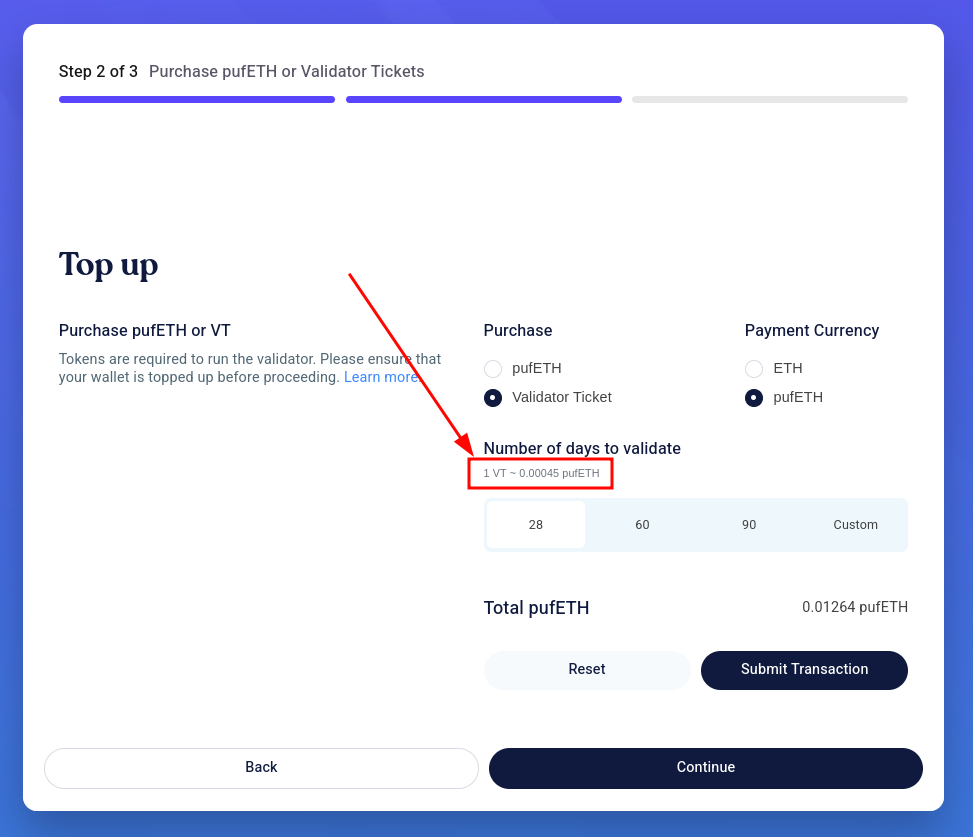

Validator Tickets are ERC20 tokens that grant the holder the right to run a staker-funded Ethereum validator for a day. Each validator consumes one VT ticket per day.

There are two ways to purchase VTs:

1. Through the "Purchase" step on [Puffer Launchpad](https://launchpad.puffer.fi/).
2. By directly calling the smart contract function.

## Purchase VTs on Puffer Launchpad

1. Navigate to the [Puffer Launchpad](https://launchpad.puffer.fi/).
2. Connect your wallet and you will be on the "Setup" step.
3. Click "Continue" to move to the next step.

   

4. On the "Purchase" step, select "Validator Ticket" to purchase and choose your preferred "Payment Currency".

   

5. Choose the amount of VTs you want to purchase and click "Submit Transaction".
6. Sign the transaction with your wallet and once successful, you will see a pop-up with the transaction hash.

   

## Purchase VTs by Directly Calling the Smart Contract

You can use Safe or any other wallet/tool that allows direct contract interactions.

1. Check the rate of `pufETH` to Validator Tickets on [Puffer Launchpad](https://launchpad.puffer.fi/Purchase). Based on the rate, decide how much `pufETH` you want to spend to purchase VTs.

   

2. Create a transaction to **approve** `pufETH` (`0xD9A442856C234a39a81a089C06451EBAa4306a72`) to be used by the `ValidatorTicket` contract (`0x7D26AD6F6BA9D6bA1de0218Ae5e20CD3a273a55A`).

   

3. Create a transaction to **call** the `purchaseValidatorTicketWithPufETH` function of the `ValidatorTicket` contract (`0x7D26AD6F6BA9D6bA1de0218Ae5e20CD3a273a55A`).

   

4. Execute the batched transactions.
