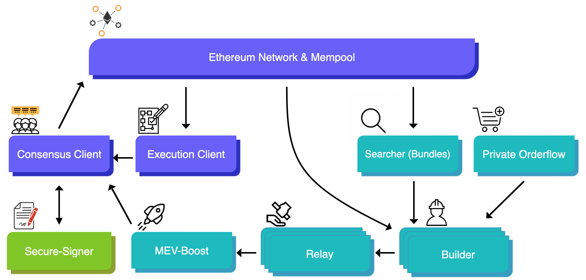
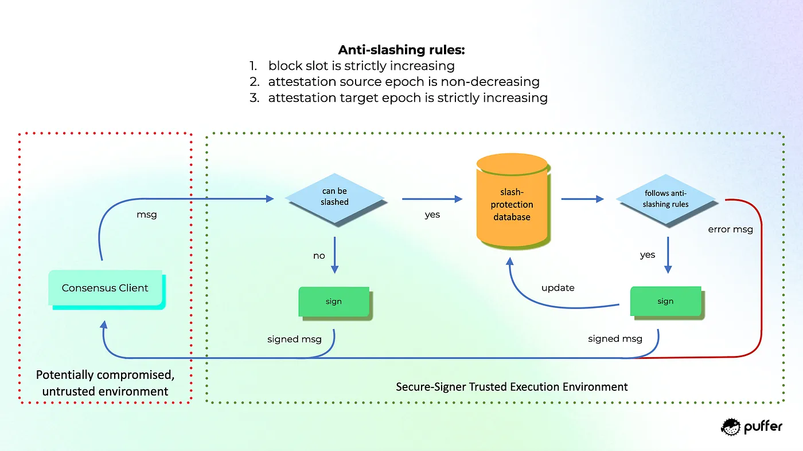

Puffer's Secure-Signer is a remote signing tool backed by an [Ethereum Foundation grant](https://blog.ethereum.org/2023/02/22/allocation-update-q4-22) designed to prevent slashable offenses using Intel SGX.

## What is it?

[Secure-Signer](https://pufferfinance.github.io/secure-signer/) leverages Trusted Execution Environments (TEEs) and is currently implemented as an [Intel SGX](https://www.intel.com/content/www/us/en/developer/tools/software-guard-extensions/overview.html) enclave. To mitigate points of failure, Puffer is committed to manufacturer diversity with plans to implement Secure-Signer on [AMD's SEV](https://developer.amd.com/sev/) TEE and new hardware as they come to market.

TEEs provide confidentiality and integrity guarantees. In the context of SGX, an enclave is a protected region of memory where code and data are stored. The enclave ensures that the code is executed as expected without tampering and that the data remains encrypted and protected. The physical hardware ensures that these properties hold.

## Where is it run?

|                                                                            |
| :---------------------------------------------------------------------------------------------: |
| Secure-Signer in the validator tech stack. Adapted from https://github.com/flashbots/mev-boost |

Secure-Signer is a remote-signing tool that manages validator keys on behalf of the consensus client. It can run locally with the consensus client or on a remote server. From the point of view of a node operator, there is little difference in setting up their validator. If they have SGX-enabled hardware, they can install and run Secure-Signer and instruct their consensus client of choice to use Secure-Signer as the remote-signer.

## How does it prevent slashing?

To prevent possible slashes through double-signing, the Secure-Signer generates and safeguards all BLS validator keys inside its encrypted and tamper-proof memory. These keys can only be accessed during runtime and remain encrypted at rest, making them inaccessible to the node unless used to sign non-slashable block proposals or attestations.

Since the keys are bound to Secure-Signer and remain encrypted, they are not at risk of being used across multiple consensus clients, protecting the node from accidental slashes due to double-signing. Additionally, their keys would be protected from hackers if their system is compromised.

Beyond safeguarding the validator key, Secure-Signer prevents slashing by maintaining an integrity-protected database of previously signed material adhering to [EIP-3076](https://eips.ethereum.org/EIPS/eip-3076). Whenever the consensus client passes Secure-Signer blocks or attestations, all validator key signatures are contingent on the following assertions holding:

> - proposal check: `slot > previous slot`
> - attestation check: `source epoch ≥ previous source epoch`
> - attestation check: `target epoch > previous target epoch`

The enclave enforces these assertions even if the node's operating system
is compromised. If a catastrophic consensus client bug (e.g., one that overrides the EIP-3076 protection), nodes using Secure-Signer would be protected as the enclave runs in an isolated environment and maintains its integrity-protected slash protection database.

By removing the possibility of slashing due to accidents or consensus client bugs, Secure-Signer significantly reduces node risk and allows the Puffer Pool to lower the bond requirement safely.

## Why use it?
Distributed Validator Technology (DVT) can be considered the "MPC approach" to reduce slashing risk but requires paying in efficiency. Secure-Signer provides a cheaper alternative for validators to increase slash resistance. It is worth noting that Secure-Signer is complimentary with DVT, where each of the N key shares is stored in Secure-Signer enclaves.

A convenient illustration is to compare hot and cold wallets. A hot wallet is active and easily accessible but vulnerable, while a cold wallet is typically an air-gapped hardware device. Currently, all validators setups are some flavor of hot wallet, as their validator key is always active and directly accessible to their consensus clients, leaving it vulnerable should their system be compromised. Secure-Signer offers validators the equivalent of a hardware wallet for protecting their keys at rest while providing stronger slash protection guarantees at runtime.

Leveraging TEEs for securing validators can be seen as a positive-sum game. From the point of view of an individual validator, using a TEE reduces the risk of lost capital due to slashing. From the point of view of the validator set, as more validators use TEEs, the risk of a highly correlated mass-slashing event decreases. For this reason, Secure-Signer was released as a public good for the entire validator set to benefit from.