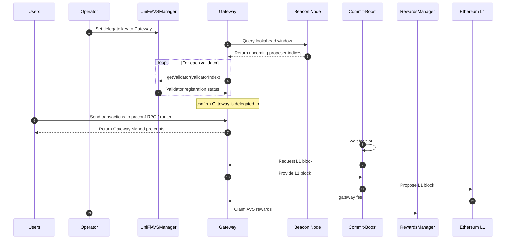
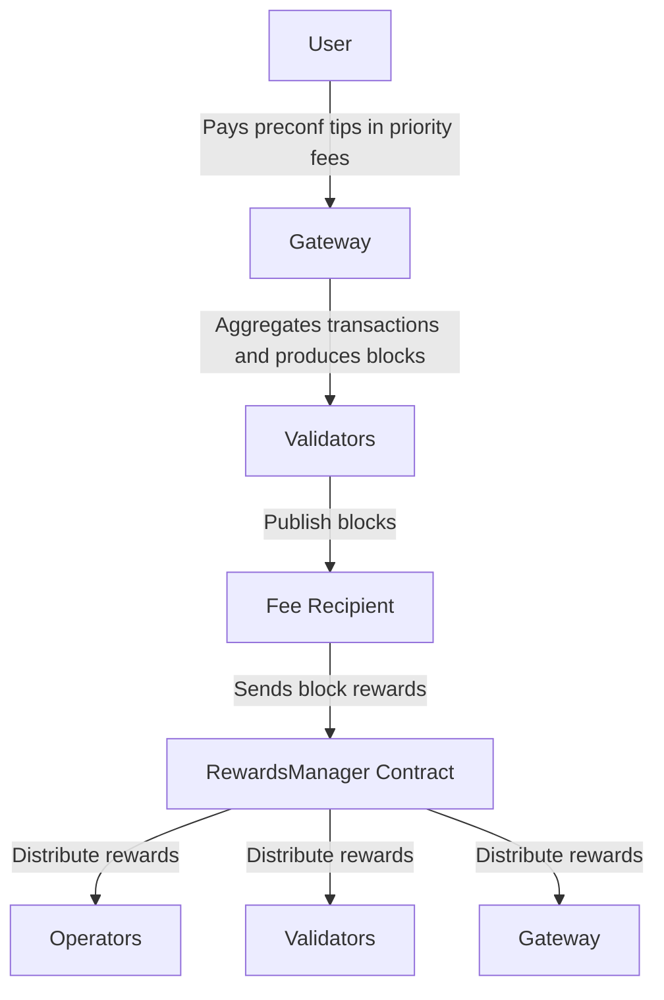
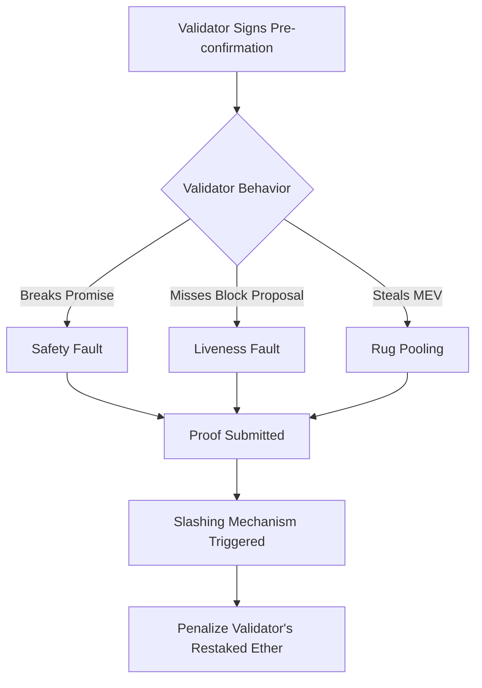

## Overview
UniFi AVS is composed of off-chain software for handling pre-conf operations, and on-chain AVS contracts for handling registrations, rewards, and punishments.

### Definitions

The UniFi AVS ecosystem involves several key components and actors:

- **Users**: Individuals or applications that submit transactions to be preconfed.
- **Operators**: Entity controlling Ethereum validators as part of the UniFi AVS protocol.
- **UniFiAVSManager**: On-chain contract responsible for managing operator and validator registrations, as well as maintaining the overall state of UniFi AVS.
- **Gateway**: Specialized off-chain entity that acts as an intermediary between users and operators to fulfill preconfirmation requests.
- **Beacon Node**: Part of the validator stack that provides information about the current state of beacon chain including the validator set and upcoming block proposers.
- **Commit-Boost**: Open-source software that standardizes the interface between validators and different types of commitment modules.
- **RewardsManager**: On-chain contract that handles the distribution of rewards to operators, validators, and gateways based on their participation and performance in UniFi AVS.

## Protocol Architecture

### High Level Preconf Flow

The preconf flow in UniFi AVS involves several interactions:

1. Operators set their delegate key to point to a Gateway
2. Gateway queries the Beacon Node for the lookahead window to check the upcoming proposers
3. Gateway checks if any of the upcoming proposers are delegated to them
4. Users send transactions to the Gateway's preconf RPC/router
5. Gateway returns signed pre-confs to Users
6. Commit-Boost requests L1 block from Gateway when it's time to propose
7. Validator proposes L1 block to Ethereum network
8. Rewards are distributed through the RewardsManager

### What is being preconfed?

UniFi AVS is designed to be a flexible and generic protocol capable of supporting various types of proposer commitments in the future. Initially, the focus is on L2 execution preconfirmations, which provide powerful guarantees for based rollup users.

Here's how L2 execution preconfirmations work:

1. **Transaction Guarantee**: A based rollup user is assured that their transaction will be included in an L2 block and executed as preconfirmed.

2. **Instant Confirmation**: Even if the preconfer is not scheduled to propose an L1 block for several minutes, users can send L2 transactions (e.g., a swap) ahead of time.

3. **Commitment to Results**: Users instantly receive a preconfirmation that commits to the specific results of their transaction (e.g., the outcome of the swap).

4. **Execution Guarantee**: When the preconfer eventually proposes the L1 block and sequences and commits to the L2 state (which could be minutes later), the transaction is guaranteed to have been executed exactly as promised in the preconfirmation.

5. **Economic Security**: If the preconfer fails to execute the transaction as promised, they will be slashed, providing strong economic incentives for honoring commitments.

This powerful concept allows for robust guarantees around both inclusion and execution, even minutes before the L2 block is considered finalized by the L1. It significantly enhances the user experience by providing near-instant transaction assurances while maintaining the security and decentralization benefits of Ethereum-based rollups.

As UniFi AVS evolves, it may support additional types of preconfirmations, further expanding its utility in the Ethereum ecosystem.

## On-Chain Components
UniFi AVS utilizes several smart contracts to manage its operations:

1. **UniFiAVSManager**: Handles AVS registrations, including operator and validator registrations.
2. **RewardsManager**: Manages the distribution of rewards to operators, validators, and gateways.
3. **DisputeManager**: Implements the slashing mechanism to penalize misbehaving validators.

### Registration

UniFi AVS implements a double opt-in registration process for operators and validators, ensuring security and flexibility:

1. **Operator Onboarding**:
   - Operators first register with EigenLayer's delegation system.
   - They then opt into the UniFi AVS, signaling their intent to participate.
   - The UniFi AVS system records the operator's registration in EigenLayer's AVS directory.

2. **Commitment Declaration**:
   - Operators specify their service parameters:
     - A delegate key for signing preconfirmations.
     - Supported based rollup chain IDs.
   - This declaration follows a two-step process with a security delay:
     - Initiate the commitment change.
     - Finalize the change after a predetermined delay.

3. **Validator Enrollment**:
   - Operators enroll validators linked to EigenPods under their delegation. They either own directly or have a trusted relationship with the EigenPod owner.
   - This trust relationship is important, as validators ultimately run Commit-Boost and propose the blocks.
   - The system verifies:
     - Proper delegation of the EigenPod to the operator.
     - Active status of the validators.
   - Enrollment is completed using the validators' BLS public key hashes.

4. **Unified Key Management**:
   - A single delegate key represents all of an operator's registered validators.
   - The system supports various key types for future flexibility.

5. **Chain Support Declaration**:
   - Operators use a 256-bit bitmap to indicate supported chains.
   - Each bit corresponds to a specific chain ID, enabling efficient support checks.

This process ensures secure and efficient onboarding of operators and validators to the UniFi AVS ecosystem, while maintaining flexibility and scalability.

### Rewards Distribution

UniFi AVS will implement a rewards distribution mechanism designed to provide consistent and attractive incentives for participating validators while addressing challenges of volatility and infrequent payouts.

1. **Pre-confirmation Fees**: 
   - Primary source of rewards, paid by users for execution preconfs.
   - Fees can be volatile and block reward payouts may be infrequent for individual validators.

2. **MEV-Smoothing**: 
   - Distributes rewards more evenly over time.
   - Mitigates volatility and infrequency of rewards.
   - Provides validators with a more stable and predictable income stream.
   - Mitigates economies of scale.

3. **Ether Payouts**: 
   - All rewards are paid out in ETH.
   - Ensures liquidity and simplicity for validators.
   - Avoids issues with illiquid or non-native tokens.

4. **Competitive Earnings**: 
   - Validators can potentially earn more than traditional PBS (Proposer-Builder Separation) methods.
   - Creates a compelling economic incentive for participation in the preconf process.

#### Rewards Flow

#### Claiming Rewards

Rewards will be distributed for each validator on the L2. Validators will be able to claim their rewards by setting a claimer address on the rewards contract by signing an EIP-712 hash with their BLS validator key.

Rewards will be calculated based on the successful participation of the validators in the preconfirmations during each reward period.

Unclaimed rewards will persist and all of it can be claimed any time in the future in a single transaction.

In addition to L2 rewards, we might distribute some rewards on the EigenLayer AVS to incentivize node operators and validators to participate in the system. Each operator can claim these rewards directly from the EigenLayer's interface.

### Slashing Mechanism

UniFi AVS will employ a DisputeManager contract to handle slashing and incentivize for honest operator behavior:

1. **Safety Faults**: Penalties for breaking preconf promises, i.e., violating an execution preconf guarantee.
2. **Liveness Faults**: Penalties for missing block proposals after signing pre-confirmations.
3. **Rug Pooling**: Penalties for stealing block rewards that are meant to be smoothed.

:::caution
The implementation of the mechanism will depend on EigenLayer's slashing design which is still TBD.
:::

#### Slashing Flow
